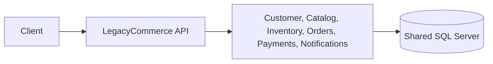

# Initial monolith
Phase 02 implements one deployment with six modules and a shared SQL Server.

```mermaid
flowchart LR
  Client --> API[LegacyCommerce API]
  API --> Modules[Customer, Catalog, Inventory, Orders, Payments, Notifications]
  Modules --> SQL[(Shared SQL Server)]
```
