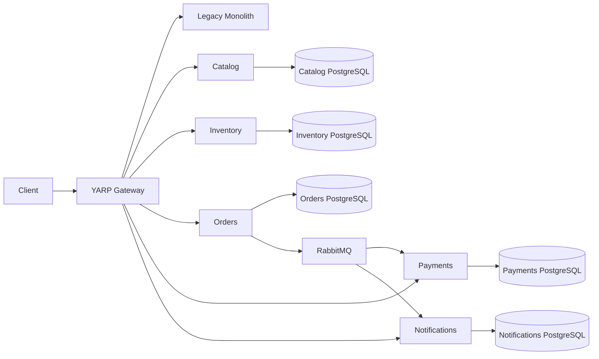

# Target architecture
This is planned, not Phase 01 implementation.

```mermaid
flowchart LR
  Client --> Gateway[YARP Gateway]
  Gateway --> Legacy[Legacy Monolith]
  Gateway --> Catalog[Catalog]
  Gateway --> Inventory[Inventory]
  Gateway --> Orders[Orders]
  Gateway --> Payments[Payments]
  Gateway --> Notifications[Notifications]
  Catalog --> CDB[(Catalog PostgreSQL)]
  Inventory --> IDB[(Inventory PostgreSQL)]
  Orders --> ODB[(Orders PostgreSQL)]
  Payments --> PDB[(Payments PostgreSQL)]
  Notifications --> NDB[(Notifications PostgreSQL)]
  Orders --> Broker[RabbitMQ]
  Broker --> Payments
  Broker --> Notifications
```
