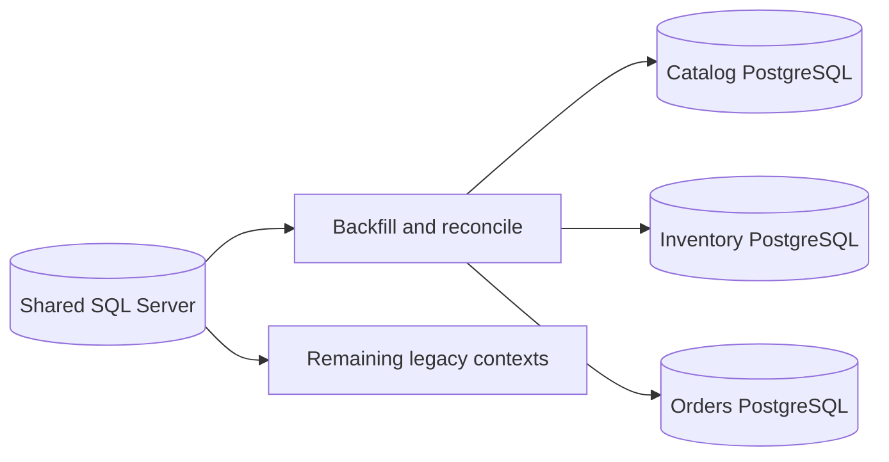

# Data transition

```mermaid
flowchart LR
  Shared[(Shared SQL Server)] --> Reconcile[Backfill and reconcile]
  Reconcile --> Catalog[(Catalog PostgreSQL)]
  Reconcile --> Inventory[(Inventory PostgreSQL)]
  Reconcile --> Orders[(Orders PostgreSQL)]
  Shared --> Remaining[Remaining legacy contexts]
```
